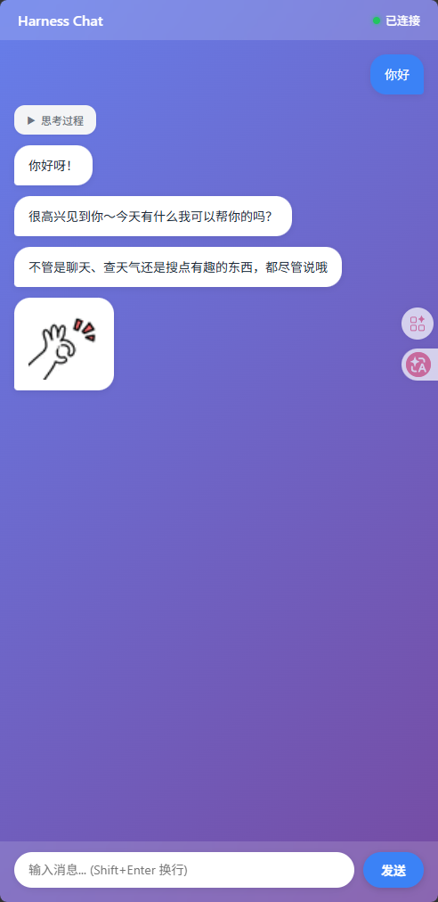

# Harness 领域 Agent 前置分析文档

> 本文档记录 `showcase/agents` 分支上领域 Agent 的设计意图、组件替换策略和技术方案分析。
>
> **版本**: v1.0 | **分支**: `showcase/agents`
>
> **状态**: `chat-web` ✅ 已实现 | `trajectory-analyst` 🔜 计划中

---

## 0. 分支策略背景

### 0.1 双线分支模型

```
master ──────────────────────────────► (框架核心持续开发)
  │ 保留: harness/ tests/ docs/ sdd/ examples/
  │ 面向: 框架开发者、贡献者
  │
  └──► showcase/agents ──────────────► (领域 Agent 展示)
       移除: sdd/
       保留: harness/ tests/ docs/ examples/
       新增: agents/chat-web/ agents/trajectory-analyst/
       面向: 框架使用者、快速体验者
```

- **单向同步**: `showcase/agents` 定期 rebase/cherry-pick `master` 核心更新，不反向合并。
- **独立演进**: showcase 上的 Agent 实现不回流 master，保持 master 纯净。
- **快速开始**: 用户 `git clone -b showcase/agents` 直接拿到可运行的领域 Agent。

### 0.2 与框架核心README卖点的呼应

两个 Agent 的设计直接体现 README 中的两条核心主张：

> **"任意替换模块 → 配置出你的领域 Agent"** —— 通过替换 `InputAdapter` / `SystemToolProvider` / `GuideProvider` 实现完全不同的 Agent。

> **"模块内递归使用 Harness → 实现更深功能"** —— 轨迹分析 Agent 本身可以读取框架产生的轨迹数据，体现框架的自省能力。

---

## 1. Agent 1: chat-web（ToC — Web 聊天助手）

### 1.1 定位与目标用户

| 维度 | 说明 |
|------|------|
| **目标用户** | 普通消费者（ToC）—— 想快速体验一个带网页界面的对话 Agent |
| **核心价值** | 展示 `InputAdapter` 的替换能力：从命令行 stdin 升级到 WebSocket 双向通信 |
| **使用场景** | 打开浏览器 → 输入文字聊天 → Agent 回复并展示工具调用状态 |
| **体验差异** | 相比 `CliAdapter` 的黑白终端，Web 界面可以流式输出、彩色区分事件类型、显示工具调用动画 |

### 1.2 组件替换策略

| 组件 | 默认实现 | 替换方案 | 替换理由 |
|------|---------|---------|---------|
| `InputAdapter` | `CliAdapter`（stdin/stdout） | **`WebSocketAdapter`** | WebSocket 全双工通信，`receive()` 等待 ws 消息，`send()` 推送事件到前端 |
| `GuideProvider` | 通用编码助手 | **聊天助手 AGENTS.md** | 亲切语气、emoji 友好、支持闲聊、消费级场景 |
| `SystemToolProvider` | read/write/shell | **+ web_search、weather** | 消费级能力：联网搜索、天气查询（替代代码操作） |
| `MemoryBackend` | `MdMemory`（全局存储） | 保留，可选用户隔离 | 若 Web 端多用户，可按 session/user 分目录 |

### 1.3 技术方案分析

**后端架构：**
```
FastAPI 服务器
  ├── WebSocket endpoint (/ws)
  │     └── WebSocketAdapter 实例（每个连接一个）
  │           ├── receive() → 阻塞等待 ws.receive_text()
  │           └── send(event) → ws.send_json() 推送事件
  │
  └── 静态文件 (static/index.html)
```

**前端界面：**



*彩色消息气泡、工具调用实时动画、自定义 emoji 渲染*

**事件流设计：**
```
用户输入 ──► WebSocketAdapter.receive() ──► Orchestrator
                                              │
LLM 回复 ◄── WebSocketAdapter.send(TextEvent) ◄──┘
                    │
              前端 JS 解析 JSON event
                    │
              ├─ type: "text" → 显示消息气泡
              ├─ type: "tool_call" → 显示"正在搜索..."
              ├─ type: "tool_result" → 显示结果摘要
              └─ type: "thinking" → 折叠/小字显示思考过程
```

**关键设计决策：**
- **WebSocket vs SSE**: 选 WebSocket 因为需要双向通信（用户输入 + Agent 输出），SSE 是单向推送不适合。
- **前端框架**: 不引入 React/Vue，用原生 HTML + JS（单文件 `index.html`，~200 行），降低依赖和门槛。
- **会话隔离**: 每个 WebSocket 连接分配独立 session_id，记忆按 session 隔离存储。

### 1.4 与默认实现的核心差异

| 对比项 | 默认（coding-assistant） | chat-web |
|--------|------------------------|----------|
| **交互介质** | 终端 stdin/stdout | 浏览器 WebSocket |
| **用户感知** | 黑底白字，工具调用在 stderr | 彩色气泡，工具状态实时动画 |
| **目标场景** | 代码开发、文件操作 | 日常对话、信息查询 |
| **部署方式** | `python main.py run` | `python server.py` → 打开浏览器 |
| **并发能力** | 单用户串行 | 多用户同时连接（每个 ws 独立 Adapter） |

---

## 2. Agent 2: trajectory-analyst（ToB — 轨迹分析元 Agent）

### 2.1 定位与目标用户

| 维度 | 说明 |
|------|------|
| **目标用户** | 框架开发者 / Agent 运维人员（ToB）—— 需要监控、评估 Agent 运行质量 |
| **核心价值** | 展示框架的**自省能力**：用 Agent 分析 Agent 自己产生的轨迹数据 |
| **使用场景** | 运行完任意 Agent 后，启动 trajectory-analyst 分析刚才的会话表现 |
| **体验差异** | 不是和人对话，而是和"Agent 的运行记录"对话 —— 查询统计、发现模式、生成报告 |

### 2.2 为什么是 Meta-Agent？

这个 Agent 的特殊之处在于：**它不连接外部数据源，它分析的是框架自身产生的数据。**

Harness 的 `LoggingSensor` 在每个会话结束后会生成轨迹文件（`memory/episodic/session_*.md`），包含：
- 执行耗时、消息轮数、工具调用次数
- 每次工具调用的成功/失败状态
- 对话历史摘要

Trajectory-analyst 读取这些轨迹，做统计分析、模式识别、质量评估 —— 这就是 **Meta-Agent（元 Agent）**。

### 2.3 组件替换策略

| 组件 | 默认实现 | 替换方案 | 替换理由 |
|------|---------|---------|---------|
| `InputAdapter` | `CliAdapter` | **保留 `CliAdapter`** | ToB 场景命令行足够，重点是工具集 |
| `GuideProvider` | 通用助手 | **轨迹分析师 AGENTS.md** | 严谨、数据驱动、评估规范、不臆测 |
| `SystemToolProvider` | read/write/shell | **轨迹分析工具集** | `list_trajectories`、`read_trajectory`、`analyze_stats`、`find_patterns`、`generate_report` |
| `Sensor` | `LoggingSensor` | **可选增强** | 可接入子 Agent 做深度评估，体现"递归使用 Harness" |
| `ContextAssembler` | `SimpleAssembler` | 保留（调大 max_history） | 分析多轨迹时需要更多上下文 |

### 2.4 自定义工具设计分析

| 工具 | 职责 | 输入 | 输出 |
|------|------|------|------|
| `list_trajectories` | 列出所有轨迹文件 | `pattern` (可选过滤), `limit` | 轨迹元数据列表 |
| `read_trajectory` | 读取单个轨迹完整数据 | `session_id` | 结构化轨迹数据（解析 YAML frontmatter + JSON） |
| `analyze_stats` | 聚合统计 | `time_range` (如 "7d") | 平均耗时、成功率分布、工具使用频率 |
| `find_patterns` | 模式识别 | `min_occurrence` | 高频错误、异常耗时会话、重复工具调用链 |
| `compare_trajectories` | 对比分析 | `session_a`, `session_b` | 差异报告（耗时、轮数、成功率、输出质量） |
| `generate_report` | 生成报告 | `output_path` (可选) | Markdown 综合分析报告 |

### 2.5 技术方案分析

**数据流：**
```
其他 Agent 运行结束
       │
       ▼
LoggingSensor → memory/episodic/session_xxx.md
       │
       ▼
trajectory-analyst 启动
       │
       ├── list_trajectories() → 发现轨迹文件
       ├── read_trajectory(session_id) → 读取数据
       ├── analyze_stats() → 计算指标
       └── generate_report() → 输出报告
```

**轨迹文件解析：**
```yaml
---                       # YAML frontmatter
key: session_cli-xxx
namespace: episodic
timestamp: 1780582800.623671
---
{                         # JSON body
  "session_id": "...",
  "execution_time": 374.58,
  "tool_call_count": 19,
  "tool_calls_summary": [...],
  ...
}
```

解析需要处理：YAML frontmatter → JSON body 的混合格式。

**关键设计决策：**
- **零外部依赖**: 不需要 SQLite、matplotlib、pandas，只读本地 markdown 文件即可运行。
- **数据自给**: 不需要人工准备测试数据 —— 运行任意 Agent（如 coding-assistant）后自动生成轨迹。
- **Sensor 增强**: 可在 `sense()` 中启动子 Agent 做深度评估，体现 README 说的"递归使用 Harness"。

### 2.6 与默认实现的核心差异

| 对比项 | 默认（coding-assistant） | trajectory-analyst |
|--------|------------------------|-------------------|
| **交互对象** | 人类用户 | 其他 Agent 的运行轨迹 |
| **输入来源** | stdin 键盘输入 | `memory/episodic/*.md` 文件 |
| **工具集** | read/write/shell | 轨迹读取 / 统计分析 / 报告生成 |
| **输出形式** | 对话式文本回复 | 结构化分析报告 |
| **核心能力** | 执行指令 | **评估与诊断** |
| **框架关系** | 框架的使用者 | **框架的自省者（Meta）** |

---

## 3. 两个 Agent 的横向对比

| 维度 | chat-web（ToC） | trajectory-analyst（ToB Meta） |
|------|----------------|-------------------------------|
| **用户类型** | 消费者 | 开发者 / 运维人员 |
| **核心亮点** | `InputAdapter` 替换（WebSocket） | `SystemToolProvider` 深度定制 + 框架自省 |
| **交互方式** | WebSocket 网页聊天 | 命令行对话 |
| **外部依赖** | FastAPI + uvicorn | **零依赖**（只读 markdown） |
| **数据获取** | 实时用户输入 | 其他 Agent 运行后自动生成 |
| **展示框架能力** | 多用户并发、事件流 | Sensor 价值、递归 Harness |
| **可复制性** | 启动服务器即可 | 先运行任意 Agent 产生轨迹 |
| **与 README 卖点契合** | "任意替换模块" | "模块内递归使用 Harness" |

---

## 4. 目录规划（实际结构）

```
agents/
├── coding-assistant/           # 已有（从 profiles/ 迁移）
│   ├── AGENTS.md
│   ├── harness.yaml
│   └── README.md
│
├── chat-web/                   # ✅ 已实现（ToC）
│   ├── AGENTS.md               # 聊天助手身份定义
│   ├── README.md               # 项目文档（含截图）
│   ├── screenshot.png          # 界面截图
│   ├── server.py               # FastAPI 入口 + per-connection Harness 生命周期
│   ├── adapter/
│   │   ├── __init__.py
│   │   └── websocket_adapter.py    # WebSocket InputAdapter 实现
│   ├── static/
│   │   ├── index.html          # 聊天前端（vanilla JS，~200 行）
│   │   └── emojis/             # 自定义表情图片（5 个）
│   │       ├── manifest.json
│   │       ├── laugh.jpg
│   │       ├── cool.jpg
│   │       ├── happy.jpg
│   │       ├── cry.jpg
│   │       └── cute.gif
│   ├── tools/
│   │   ├── __init__.py
│   │   ├── web_search.py       # 模拟网络搜索
│   │   └── weather.py          # 模拟天气查询
│   └── tests/                  # 测试套件（4 模块，1444 行）
│       ├── __init__.py
│       ├── test_websocket_adapter.py
│       ├── test_tools.py
│       ├── test_emojis.py
│       └── test_e2e.py
│
└── trajectory-analyst/         # 🔜 计划中（ToB Meta）
    ├── AGENTS.md               # 轨迹分析师身份定义
    ├── harness.yaml            # 装配轨迹分析工具集
    ├── tools/
    │   ├── __init__.py
    │   ├── trajectory_reader.py    # list / read
    │   ├── stats_analyzer.py       # analyze_stats
    │   ├── pattern_finder.py       # find_patterns
    │   ├── comparator.py           # compare_trajectories
    │   └── report_generator.py     # generate_report
    └── README.md
```

---

## 5. 开发顺序

### ✅ Phase 1: chat-web（已完成）

```
Phase 1: chat-web ✅
  ├── ✅ 实现 WebSocketAdapter（InputAdapter 协议，线程安全队列桥接）
  ├── ✅ 实现 FastAPI 服务器 + WebSocket 路由（per-connection Harness 生命周期）
  ├── ✅ 编写前端 index.html（vanilla JS，彩色气泡 + 工具动画 + emoji 渲染）
  ├── ✅ 编写 chat-web/AGENTS.md（聊天助手身份 + 5 个自定义 emoji 约束）
  ├── ✅ 实现 web_search / weather 消费级工具
  ├── ✅ 实现 before_assemble Hook（动态注入 emoji 严格规则）
  ├── ✅ 编写测试套件（4 模块，1444 行：adapter / tools / emojis / e2e）
  └── ✅ 捕获界面截图 screenshot.png
```

### 🔜 Phase 2: trajectory-analyst（计划中）

```
Phase 2: trajectory-analyst
  ├── 实现轨迹读取工具（解析 YAML+JSON 混合格式）
  ├── 实现统计分析工具
  ├── 实现模式识别工具
  ├── 实现报告生成工具
  ├── 编写 trajectory-analyst/AGENTS.md
  └── 编写 harness.yaml 装配声明
```

### 🔜 Phase 3: 收尾（部分完成）

```
Phase 3: 收尾
  ├── ✅ 更新 agents/chat-web/README.md（添加截图、目录、测试说明）
  ├── ✅ 更新 agents/DESIGN.md（标注实现状态）
  ├── 🔜 更新根 README.md（添加 Agent showcase 导航）
  ├── 🔜 添加 agents/README.md（"如何创建你的领域 Agent" 教程）
  └── 🔜 trajectory-analyst 实现
```

---

> **注意**: `chat-web` 完整实现代码位于 `agents/chat-web/` 目录中。本文档为设计分析，实现细节参见各组件源码及 README。
