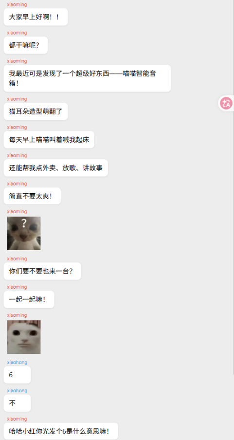
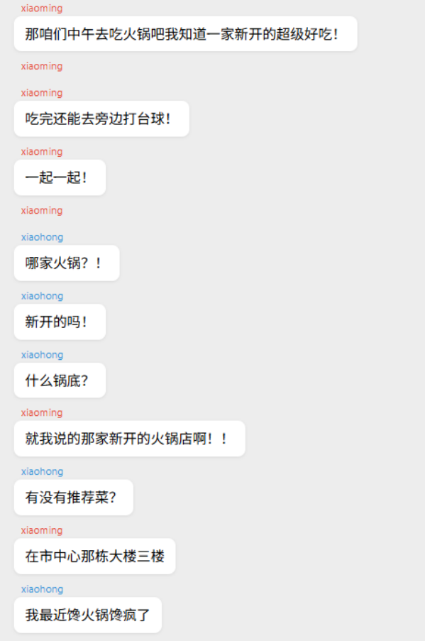
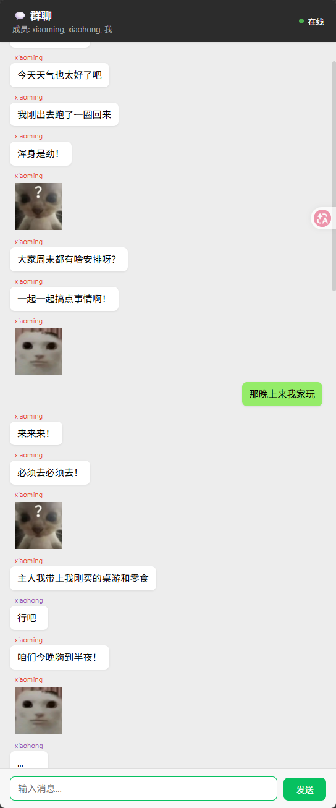

# Group Chat — 多人实时群聊 Agent

> 基于 Harness Agent Runtime 的多 Agent + 用户实时群聊系统。
>
> 多个性格迥异的 Agent 与真实用户共处一个聊天房间，像真人微信群里一样抢话、插话、潜水、接梗。

---

## 效果展示

### 差异化性格与产品推广

小明（热情话痨）在群里自然安利"喵喵智能音箱"，小红（高冷敷衍）只回"6"、"不"、"..."。同一群聊中不同 Agent 展现出截然不同的说话风格和参与度。



### 自然抢话与插话

小明的长消息被原子化切分为短句发送，中间留出时间窗口。小红在小明还没说完时就连续插话提问——"哪家火锅？！"、"新开的吗！"、"什么锅底？"——完美复刻了真实群聊的抢话感。



### 用户参与群聊

用户作为群成员直接参与对话（绿色气泡）。Agent 能看到用户消息并实时回复，形成真正的多对多群聊体验。



---

## 快速启动

### 方式一：终端模式（Mode B）

纯文本终端，适合快速体验和调试：

```bash
python -c "
from harness.runtime.cli_console import CliConsole
from harness.runtime.runtime import Runtime
console = CliConsole(mode='mode_b')
Runtime(console).run_from_script('agents/group-chat/group_chat_demo.py')
"
```

启动后，Agent 会自动开始对话。你可以在终端看到完整的群聊过程。

### 方式二：Web 模式（推荐）

浏览器访问，支持多参与者气泡显示、表情渲染、实时消息推送：

```bash
# 1. 安装依赖
pip install fastapi uvicorn

# 2. 启动服务器
python agents/group-chat/server.py

# 3. 打开浏览器访问 http://localhost:8000
```

在网页输入框中发送消息，Agent 会实时回复。

---

## 架构

```
┌──────────────────────────────────────────────┐
│           Browser (WebSocket)                │
│   多参与者气泡、表情渲染、输入框               │
└──────────────┬───────────────────────────────┘
               │ WebSocket
┌──────────────▼───────────────────────────────┐
│   GroupChatWebServer (FastAPI)               │
│   用户消息 → kernel.message_bus.publish        │
└──────────────┬───────────────────────────────┘
               │
┌──────────────▼───────────────────────────────┐
│   MessageBus                                 │
│   "user" → xiaoming, xiaohong                │
│   xiaoming → xiaohong, user前端               │
│   xiaohong → xiaoming, user前端               │
└──────────────┬───────────────────────────────┘
               │
┌──────────────▼───────────────────────────────┐
│   Agent 个体层（每个 Agent 独立）              │
│                                              │
│   AtomicOutputAdapter                        │
│     └─ FlexibleGroupChatInputAdapter         │
│           └─ KernelBridgeAdapter             │
│                                              │
│   + SelectiveGroupChatAssembler              │
│   + Async Orchestrator + LLM                 │
└──────────────────────────────────────────────┘
```

### Adapter 链

每个 Agent 的 I/O 经过三层适配器：

```
AtomicOutputAdapter
  └─ FlexibleGroupChatInputAdapter
        └─ KernelBridgeAdapter (内部创建)
```

| 层级 | 组件 | 职责 |
|------|------|------|
| 外层 | `AtomicOutputAdapter` | 解析 LLM 的 `[选择]`/`[回复]` 结构化输出，按中文标点切分为短句，间隔随机延迟逐个发送 |
| 中间 | `FlexibleGroupChatInputAdapter` | 维护消息缓冲窗口，控制 Agent 何时触发回复（时间随机性驱动） |
| 内层 | `KernelBridgeAdapter` | 对接 MessageBus，实际的消息收发 |

---

## Agent 配置

当前演示包含两个性格迥异的 Agent：

### 小明（xiaoming）— 热情话痨

```python
min_wait=0.3, max_wait=2.0, jitter=0.3
persona="超级热情外向，话多且密，什么事都要掺和一脚"
speaking_style="每句话都带感叹号！充满能量！"
max_consecutive_replies=5
```

- 响应极快（最短 0.3 秒），话多且密
- 自带 `initial_injection`：前 4 轮会自然安利"喵喵智能音箱"
- 连续发言上限 5 轮，避免一个人霸屏

### 小红（xiaohong）— 高冷美食控

```python
min_wait=1.5, max_wait=5.0, jitter=0.6
persona="高冷、敷衍、惜字如金"
speaking_style="平时回复非常短，3-5个字。常用'嗯'、'行吧'、'...'"
interests="对吃的话题特别感兴趣！火锅、奶茶、甜品..."
```

- 响应慢半拍（最短 1.5 秒），平时极简回复
- 但一聊到**美食话题**就破防，瞬间变话痨
- `interests` 机制让 Agent 在特定话题下改变行为模式

---

## 核心机制

### 1. 差异化响应节奏

每个 Agent 独立拥有 `FlexibleGroupChatInputAdapter` 实例，通过 `min_wait`/`max_wait`/`jitter` 三个参数控制响应节奏：

- **min_wait**：收到第一条消息后至少等待多久才触发
- **max_wait**：超过这个时间强制触发（避免永远等待）
- **jitter**：随机抖动，避免多个 Agent 同时触发

不同 Agent 配置不同参数，有的急性子、有的慢半拍，节奏差异是群聊自然感的主要来源。

### 2. 原子化输出与抢话

LLM 输出被 `AtomicOutputAdapter` 解析为结构化格式：

```
[选择] 3
[回复] 带飞盘我可以一起！:happy:
```

回复内容按中文标点（`。`、`！`、`？`、换行）切分为短句，每个短句作为独立消息发送，句子之间加入 250-800ms 随机延迟。这创造了**可被打断的插话窗口**——其他 Agent 可以在两句之间插入回复。

### 3. 选择式回复

`SelectiveGroupChatAssembler` 给缓冲中的消息编号，要求 LLM 从最近消息中**选择一条**回复：

```
最近群聊消息：
1. [小明] 今天天气真好
2. [主人] 我们去公园吧
3. [主人] 带上飞盘怎么样？

请从以上消息中选择一条回复。输出格式：
[选择] <编号或0>
[回复] <内容或'无'>
```

LLM 可以选择不回复（`[选择] 0`），实现"潜水"效果。

### 4. 表情系统

支持 5 个专用表情 ID：`:happy:`、`:laugh:`、`:cool:`、`:cry:`、`:cute:`。LLM 在回复中自然插入表情标记，前端渲染为对应图片。每条回复最多 2 个表情。

---

## 定制自己的群聊

编辑 `group_chat_demo.py`，修改或新增 `@agent` 声明：

```python
@agent(
    "my_agent",
    entry_prompt="你是...",
    metadata={
        "display_name": "我的Agent",
        "min_wait": 0.5,
        "max_wait": 3.0,
        "jitter": 0.4,
        "persona": "你的性格描述",
    },
)
def assemble_my_agent():
    return _assemble_agent(
        name="my_agent",
        display_name="我的Agent",
        persona="你的性格描述",
        speaking_style="你的说话风格",
        interests="你感兴趣的话题",
        min_wait=0.5,
        max_wait=3.0,
        jitter=0.4,
    )

# 别忘了添加订阅关系
subscribe("my_agent").to("xiaoming")
subscribe("xiaoming").to("my_agent")
subscribe("my_agent").to("user")
```

### 可调参数

| 参数 | 类型 | 说明 |
|------|------|------|
| `min_wait` | float | 最短等待时间（秒），控制响应速度 |
| `max_wait` | float | 最长等待时间（秒），防止永远等待 |
| `jitter` | float | 随机抖动上限（秒），避免碰撞 |
| `persona` | str | 性格描述 |
| `speaking_style` | str | 说话风格补充 |
| `interests` | str | 兴趣话题，匹配时 Agent 变得更热情 |
| `max_consecutive_replies` | int | 最大连续自回复轮数，防霸屏 |
| `initial_injection` | str | 前 N 轮注入的系统提示（如推广产品） |
| `injection_rounds` | int | initial_injection 持续的轮数 |

---

## 文件结构

```
agents/group-chat/
├── README.md                   # 本文件
├── AGENTS.md                   # Agent 指导文件（LLM 行为约束）
├── group_chat_demo.py          # Workflow 脚本（Agent 定义 + 订阅关系）
├── server.py                   # FastAPI + WebSocket 服务器
├── test_e2e.py                 # 端到端测试
└── static/
    ├── index.html              # 前端页面
    └── emojis/                 # 表情图片资源
        ├── happy.jpg
        ├── laugh.jpg
        ├── cool.png
        ├── cry.jpg
        └── cute.gif
```

---

## 技术亮点

- **零框架核心修改**：全部通过新增组件 + Workflow 脚本配置实现，不改动 `harness/core/` 和 `harness/runtime/` 核心逻辑（仅 2 处必要的扩展点注入）
- **时间驱动优先**：MVP 用时间参数和随机性制造自然节奏，不做复杂的内容打分或 LLM 辅助决策
- **局部不一致是特性**：不同 Agent 触发时间不同、缓冲内容不同，视角天然不一致——这正是真实群聊的感觉
- **数据契约先行**：`UserRequest.metadata["buffered"]` 是 InputAdapter 与 Assembler 之间的唯一数据契约

---

## 相关文档

- [docs/design/group-chat-runtime.md](../../docs/design/group-chat-runtime.md) — 完整顶层设计方案（15 节）
- [docs/runtime/architecture.md](../../docs/runtime/architecture.md) — Runtime 层架构概览
- [docs/runtime/io-guide.md](../../docs/runtime/io-guide.md) — 命令参考与交互模式
