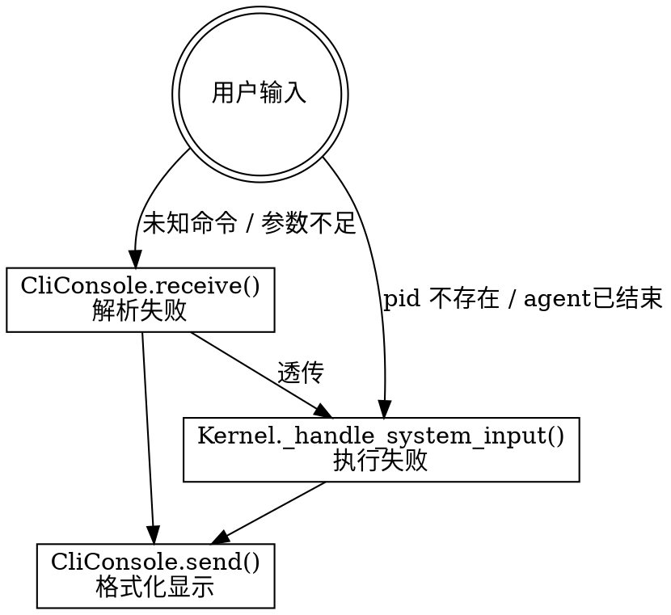

# Batch 4: 系统命令 + CliConsole 完善

> 版本: 0.2 | 日期: 2026-06-09 | 状态: 设计评审
> 依赖: Batch 3（MessageBus + 消息订阅 + 并发 + 终止）
>
> **与顶层设计的偏差说明**：顶层设计（2026-06-08）原始规划中，SIGINT 两阶段处理、`_monitor_quiescence` 完整实现、`asyncio.gather(return_exceptions=True)` 和 `asyncio.shield` 保护 `_phase_end` 属于 Batch 4 范围。实际实现中，这些点在 Batch 3 已提前交付。本 spec 反映实际代码现状，不再重复实现。详细设计文档（2026-06-09）的完成度矩阵（Section 3.8）已体现此调整。

---

## 一、目标

在 Batch 3 完整多 agent 协作闭环基础上，实现 CLI 交互式 Runtime 管理能力。让用户通过 `/` 前缀命令查看 agent 状态、定向通信、终止单个 agent 或整个 workflow、优雅退出。

本 batch 结束时：
- 6 种 `SystemCommand` 类型完整定义，覆盖所有 CLI 交互场景
- 2 种查询响应 `SystemEvent` 类型（`AgentsListed`, `CommandError`）
- 1 种信息提示 `SystemEvent` 类型（`SystemMessage`）
- `CliConsole.receive()` 解析 `/` 前缀命令，Mode A/B 下纯文本路由正确
- `Kernel._handle_system_input()` 从 stub 升级为完整命令分发循环
- `CliConsole.send()` 支持新事件类型格式化输出
- 空输入、EOF、不存在的 pid/flag 等边界情况全部处理
- 全部现有测试继续通过

---

## 二、前置条件

以下接口/组件已存在且**不做任何修改**：

| 组件 | 位置 | 用途 |
|------|------|------|
| `MessageBus` | `harness/runtime/message_bus.py` | pub-sub 路由，Batch 4 无需修改 |
| `Kernel._on_agent_finished()` | `harness/runtime/kernel.py` | child_finished + 级联终止，Batch 4 无需修改 |
| `Kernel._monitor_quiescence()` | `harness/runtime/kernel.py` | 静默检测，Batch 4 无需修改 |
| `Kernel.spawn_root()` / `spawn_from_script()` | `harness/runtime/kernel.py` | agent 创建，Batch 4 无需修改 |
| `KernelBridgeAdapter` | `harness/runtime/bridge_adapter.py` | I/O 通道，Batch 4 无需修改 |
| `AgentRuntime` / `AgentState` | `harness/runtime/agent_runtime.py` | 状态机 + run()，Batch 4 无需修改 |
| `Runtime` | `harness/runtime/runtime.py` | 顶层入口，仅需小改——传递 mode 信息给 CliConsole |
| `signals.py` | `harness/runtime/signals.py` | SIGINT 两阶段处理，已完整，Batch 4 无需修改 |
| `SystemConsole` Protocol | `harness/interfaces/system_console.py` | 接口定义，Batch 4 无需修改 |
| 所有 Runtime tool | `harness/runtime/tools.py` | spawn_workflow / end_workflow / talk_to 等，Batch 4 无需修改 |

---

## 三、新增/修改的组件

| 组件 | 类型 | 文件 | 需展开内部设计 |
|------|------|------|--------------|
| `CommandKill` | 新增 | `harness/runtime/types.py` | 否（纯 dataclass） |
| `CommandListAgents` | 新增 | `harness/runtime/types.py` | 否（纯 dataclass） |
| `CommandEndWorkflow` | 新增 | `harness/runtime/types.py` | 否（纯 dataclass） |
| `CommandExit` | 新增 | `harness/runtime/types.py` | 否（纯 dataclass） |
| `CommandTalkDirect` | 新增 | `harness/runtime/types.py` | 否（纯 dataclass） |
| `AgentsListed` | 新增 | `harness/runtime/types.py` | 否（纯 dataclass） |
| `CommandError` | 新增 | `harness/runtime/types.py` | 否（纯 dataclass） |
| `SystemMessage` | 新增 | `harness/runtime/types.py` | 否（纯 dataclass） |
| `SystemCommand` union | 修改 | `harness/runtime/types.py` | 否（扩展 union） |
| `SystemEvent` union | 修改 | `harness/runtime/types.py` | 否（扩展 union） |
| `CliConsole.__init__()` | 修改 | `harness/runtime/cli_console.py` | 否（新增 mode 参数） |
| `CliConsole.receive()` | 修改 | `harness/runtime/cli_console.py` | **是** — 命令解析逻辑 |
| `CliConsole.send()` | 修改 | `harness/runtime/cli_console.py` | **是** — 新事件类型格式化 |
| `Kernel._handle_system_input()` | 修改 | `harness/runtime/kernel.py` | **是** — stub → 完整实现 |
| `Runtime._run_async()` | 修改 | `harness/runtime/runtime.py` | 否（传递 mode="mode_a"） |
| `Runtime._run_from_script_async()` | 修改 | `harness/runtime/runtime.py` | **是** — 传递 mode + 诚实退出 |
| `harness/runtime/__init__.py` | 修改 | `harness/runtime/__init__.py` | 否（新增类型 re-export） |

### 3.1 跨 Batch 接口契约

Batch 4 完成后，暴露给 Batch 5 的稳定 import：

```python
from harness.runtime.types import (
    # SystemCommand — Batch 4 完整化
    CommandTalk, CommandKill, CommandListAgents,
    CommandEndWorkflow, CommandExit, CommandTalkDirect,
    SystemCommand,  # union 类型
    # SystemEvent — Batch 4 新加
    AgentsListed, CommandError, SystemMessage,
    SystemEvent,  # union 类型（扩展）
)
from harness.runtime.cli_console import CliConsole  # mode 参数新增
# Kernel._handle_system_input — 完整实现
# Runtime — mode 信息传递
```

---

## 四、关键组件设计

### 4.1 新增 SystemCommand 类型

```python
# harness/runtime/types.py — 追加于现有 CommandTalk 之后

@dataclass
class CommandKill:
    """/kill <pid> — 终止指定 agent。

    Attributes:
        pid: 目标 agent 标识。
    """
    pid: str


@dataclass
class CommandListAgents:
    """/agents — 列出所有 agent 状态。

    无参数命令，仅作为类型标记。
    """
    pass


@dataclass
class CommandEndWorkflow:
    """/end <flag> — 终止整个 workflow。

    Attributes:
        flag: workflow 标识（如 "wf_001" 或 "wf_root"）。
    """
    flag: str


@dataclass
class CommandExit:
    """/exit — 优雅退出 Runtime。

    无参数命令，向全体 agent 推送 __EXIT_SENTINEL__。
    """
    pass


@dataclass
class CommandTalkDirect:
    """/talk <pid> <text> — 定向向指定 agent 发送消息（Mode B）。

    Attributes:
        pid: 目标 agent 标识。
        text: 消息文本。
    """
    pid: str
    text: str


# ── SystemCommand union 更新 ──
# 替换原来的 SystemCommand = CommandTalk
# 注意：CommandError 也在 union 中——CliConsole.receive() 解析失败时
# 返回 CommandError 作为"命令"，Kernel 收到后透传给 console.send() 显示。
SystemCommand = (
    CommandTalk | CommandKill | CommandListAgents
    | CommandEndWorkflow | CommandExit | CommandTalkDirect
    | CommandError
)
```

### 4.2 新增 SystemEvent 查询响应类型

```python
# harness/runtime/types.py — 追加于现有 SystemEvent 类型之后

@dataclass
class AgentsListed:
    """/agents 响应 — agent 状态快照。

    Attributes:
        agents: pid → {state, mode, parent, rounds, error} 映射。
    """
    agents: dict = field(default_factory=dict)


@dataclass
class CommandError:
    """系统命令执行失败。

    Attributes:
        command: 触发的命令文本（如 "/kill unknown"）。
        error: 错误描述。
    """
    command: str = ""
    error: str = ""


@dataclass
class SystemMessage:
    """系统信息提示（非错误）。

    区别于 CommandError：SystemMessage 是正常的系统提示信息，
    如 "所有 agent 已完成，按 Enter 退出"。不应以"[系统] 错误:" 前缀显示。

    Attributes:
        message: 提示文本。
    """
    message: str = ""


# ── SystemEvent union 更新 ──
SystemEvent = (
    AgentSpawned | AgentStateChanged | AgentFinished
    | AgentOutput | RuntimeStarted | RuntimeStopped
    | WorkflowFinished
    | AgentsListed     # Batch 4
    | CommandError     # Batch 4
    | SystemMessage    # Batch 4
)
```

### 4.3 `CliConsole.receive()` — 命令解析

```
async def receive(self) -> SystemCommand:
    """从 stdin 读取一行，解析为 SystemCommand。

    解析规则：
    1. EOF (readline 返回 "") → CommandExit()
    2. 以 "/" 开头 → 系统命令解析:
       /agents              → CommandListAgents()
       /kill <pid>          → CommandKill(pid)
       /end <flag>          → CommandEndWorkflow(flag)
       /exit                → CommandExit()
       /talk <pid> <text>   → CommandTalkDirect(pid, text)
       无法识别的 / 命令     → CommandError(command=line, error="未知命令")
    3. 空输入（仅回车）:
       - Mode A: 忽略 → 重新 readline
       - Mode B + agents 全部 FINISHED: → CommandExit()
       - Mode B + agents 运行中: → CommandError(command="", error="...")
    4. 纯文本:
       - Mode A: CommandTalk(pid="root", text=line)
       - Mode B: CommandError(command=line, error="纯文本需 /talk <pid> <text> 指定目标")
    """
```

**伪代码**：

```
async def receive():
    while True:
        line = await asyncio.to_thread(sys.stdin.readline)

        # EOF
        if not line:
            return CommandExit()

        text = line.rstrip('\n')

        # 空输入
        if not text:
            if self._mode == "mode_a":
                continue  # 忽略空白行
            else:
                # Mode B: 检查是否所有 agent 已结束
                if self._all_finished_hook and self._all_finished_hook():
                    return CommandExit()
                else:
                    return CommandError(
                        command="",
                        error="纯文本需 /talk <pid> <text> 指定目标。"
                              "输入 /agents 查看状态，/exit 退出"
                    )

        # 系统命令
        if text.startswith('/'):
            return self._parse_command(text)

        # 纯文本
        if self._mode == "mode_a":
            return CommandTalk(pid="root", text=text)
        else:
            return CommandError(
                command=text,
                error="纯文本需 /talk <pid> <text> 指定目标。"
                      "输入 /agents 查看状态，/exit 退出"
            )


def _parse_command(text):
    parts = text.split(maxsplit=2)

    # /agents
    # /exit
    if parts[0] in ('/agents', '/exit'):
        if len(parts) > 1:
            return CommandError(
                command=text,
                error=f"'{parts[0]}' 不接受额外参数"
            )
        if parts[0] == '/agents':
            return CommandListAgents()
        else:
            return CommandExit()

    # /kill <pid>
    if parts[0] == '/kill':
        if len(parts) < 2:
            return CommandError(command=text, error="用法: /kill <pid>")
        return CommandKill(pid=parts[1])

    # /end <flag>
    if parts[0] == '/end':
        if len(parts) < 2:
            return CommandError(command=text, error="用法: /end <flag>")
        return CommandEndWorkflow(flag=parts[1])

    # /talk <pid> <text>
    if parts[0] == '/talk':
        if len(parts) < 2:
            return CommandError(command=text, error="用法: /talk <pid> <text>")
        if len(parts) < 3:
            return CommandError(command=text, error="用法: /talk <pid> <text> (缺少消息文本)")
        return CommandTalkDirect(pid=parts[1], text=parts[2])

    # 未知命令
    return CommandError(command=text, error=f"未知命令: '{parts[0]}'")
```

**关键决策**：

| 决策 | 结论 | 理由 |
|------|------|------|
| 命令解析放在哪里 | `CliConsole.receive()` | SystemConsole 是前端，负责把原始输入翻译成类型化命令。Kernel 只收类型化命令，不做字符串解析 |
| `CliConsole` 如何知道 Mode A/B | 构造函数 `mode` 参数 + 可选的 `all_finished` 回调 | Mode 在构造时确定不变。Mode B 空输入行为依赖"是否所有 agent 已结束"，通过回调查询而非直接引用 Kernel，保持低耦合 |
| `/talk` 的 text 分词策略 | `split(maxsplit=2)` — 仅取前两个空格分隔，剩余全部为 text | text 可以包含空格（`/talk collector 请重新分析一下`），`maxsplit=2` 保证 `请重新分析一下` 不被拆分 |
| EOF 行为 | 统一视为 `/exit` | `readline` 在 EOF 返回 `""`，这是用户明确表示结束交互的信号 |
| Mode A 空输入 | 忽略（continue） | 用户误按回车不应触发任何行为。不产生不必要的 SystemCommand |
| Mode B 空输入 (agents 运行中) | `CommandError`，提示使用 `/talk` 或 `/exit` | 提醒用户 Mode B 下纯文本不会路由到任何 agent |
| Mode B 空输入 (agents 全部 FINISHED) | `CommandExit()` | 见 Section 4.6 |

### 4.4 `Kernel._handle_system_input()` — 完整命令分发

从 Batch 1 stub（仅处理 `CommandTalk`）升级为完整实现。

```
async def _handle_system_input():
    while not self._shutdown:
        command = await self._console.receive()

        # ── CommandTalk: 纯文本路由 ──
        if isinstance(command, CommandTalk):
            if command.pid in self.runtime_table:
                self.send_input(command.pid, UserRequest(text=command.text))
            else:
                await self._console.send(CommandError(
                    command=command.text[:50],
                    error=f"pid '{command.pid}' 不存在"
                ))

        # ── CommandKill: 终止单个 agent ──
        # 注意：AgentStateChanged 是乐观先行发出的——kill() 只设置
        # should_exit=True + 推送 sentinel，agent 的 state 要到其 run()
        # 进入 finally 块后才变成 TERMINATING。时间窗口取决于 agent 当前
        # 处于 receive() 等待（秒级）还是 LLM 调用中（数十秒）。
        elif isinstance(command, CommandKill):
            if command.pid in self.runtime_table:
                self.kill(command.pid)
                await self._console.send(AgentStateChanged(
                    pid=command.pid,
                    old=self.runtime_table[command.pid].state.value,
                    new="terminating",
                ))
            else:
                await self._console.send(CommandError(
                    command=f"/kill {command.pid}",
                    error=f"pid '{command.pid}' 不存在"
                ))

        # ── CommandListAgents: 列出所有 agent ──
        elif isinstance(command, CommandListAgents):
            info = self.list_agents()
            await self._console.send(AgentsListed(agents=info))

        # ── CommandEndWorkflow: 终止整个 workflow ──
        elif isinstance(command, CommandEndWorkflow):
            if command.flag in self.workflow_table:
                killed = self.end_workflow(command.flag)
                # 为每个被 kill 的 agent 推送状态变更事件
                for pid in killed:
                    agent = self.runtime_table.get(pid)
                    if agent:
                        await self._console.send(AgentStateChanged(
                            pid=pid,
                            old=agent.state.value,
                            new="terminating",
                        ))
            else:
                await self._console.send(CommandError(
                    command=f"/end {command.flag}",
                    error=f"workflow flag '{command.flag}' 不存在"
                ))

        # ── CommandExit: 优雅退出 ──
        elif isinstance(command, CommandExit):
            for pid, agent in self.runtime_table.items():
                if agent.state != AgentState.FINISHED:
                    agent.should_exit = True
                    if pid in self.input_queues:
                        self.input_queues[pid].put_nowait(__EXIT_SENTINEL__)
            self._shutdown = True
            return  # 退出循环

        # ── CommandTalkDirect: 定向消息（Mode B） ──
        elif isinstance(command, CommandTalkDirect):
            target = self.runtime_table.get(command.pid)
            if target is None:
                await self._console.send(CommandError(
                    command=f"/talk {command.pid}",
                    error=f"pid '{command.pid}' 不存在"
                ))
            elif target.state == AgentState.FINISHED:
                await self._console.send(CommandError(
                    command=f"/talk {command.pid}",
                    error=f"Agent '{command.pid}' 已结束 (FINISHED)，"
                          f"无法接收消息"
                ))
            else:
                self.send_input(
                    command.pid,
                    UserRequest(text=command.text)
                )

        # ── CommandError (由 CliConsole 解析失败产生) ──
        elif isinstance(command, CommandError):
            await self._console.send(command)  # 直接回显给用户
```

**重要**：`_handle_system_input` 不处理 `AgentsListed` 或 `CommandError` 作为输入命令——这些是**输出事件**，由 `CliConsole.send()` 格式化显示。

### 4.5 `CliConsole.send()` — 新事件类型格式化

现有 `send()` 方法追加两个分支：

```python
elif isinstance(event, AgentsListed):
    if not event.agents:
        print("[系统] 没有运行中的 agent")
    else:
        print(f"[系统] Agents ({len(event.agents)}):")
        print(f"  {'PID':12} {'STATE':13} {'MODE':11} {'ROUNDS':7} {'PARENT'}")
        print(f"  {'-'*12} {'-'*13} {'-'*11} {'-'*7} {'-'*12}")
        for pid, info in event.agents.items():
            parent = info.get("parent") or "-"
            state = info.get("state", "?")
            mode = info.get("mode", "?")
            rounds = str(info.get("rounds", "?"))
            error = " ⚡" if info.get("error") else ""
            print(
                f"  {pid:12} {state:13} {mode:11} "
                f"{rounds:7} {parent:12}{error}"
            )

elif isinstance(event, CommandError):
    print(f"[系统] 错误: {event.error}")
    if event.command:
        print(f"  命令: {event.command}")

elif isinstance(event, SystemMessage):
    print(f"[系统] {event.message}")
```

### 4.6 Mode B 结束行为修正

当前代码用 `task_sys.cancel()` 试图中断 `_handle_system_input`，但 `asyncio.to_thread(sys.stdin.readline)` 的底层线程在 C 级别阻塞，`CancelledError` 无法传递到线程内。实际行为是用户需要按一次回车 → `readline` 返回 → `task_sys` 发现 `CancelledError`（如果 cancel 已触发）。

**修正方案**：不试图取消，而是让 `_handle_system_input` 自然地等待用户按回车退出。

修改 `Runtime._run_from_script_async()`：

```python
# 修改前（当前代码）：
try:
    agent_tasks = list(self._kernel._tasks.values())
    await asyncio.gather(
        *agent_tasks, task_mon,
        return_exceptions=True,
    )
finally:
    task_sys.cancel()  # ← 无效取消，readline 线程卡住
    try:
        await task_sys
    except asyncio.CancelledError:
        pass
    ...

# 修改后：
try:
    agent_tasks = list(self._kernel._tasks.values())
    await asyncio.gather(
        *agent_tasks, task_mon,
        return_exceptions=True,
    )
finally:
    # 提示用户退出（用 SystemMessage 而非 CommandError——这是提示信息不是错误）
    await self._console.send(SystemMessage(
        message="所有 agent 已完成。按 Enter 退出..."
    ))
    # task_sys 仍在 readline 中阻塞——等用户按 Enter 后
    # _handle_system_input 中的 readline 返回 → while 循环
    # 检查 _shutdown (False) → 继续 receive()
    # → CliConsole.receive() 检测到 all_finished
    # → 返回 CommandExit() → _handle_system_input
    # 设 _shutdown=True → 退出循环
    try:
        await task_sys
    except asyncio.CancelledError:
        pass
    ...
```

配合 `CliConsole.receive()` 中 Mode B 空输入时检查 `_all_finished_hook` → `CommandExit()`：

```python
# CliConsole.__init__ 新增参数：
def __init__(self, mode: str = "mode_a", all_finished_hook=None):
    self._mode = mode
    self._all_finished_hook = all_finished_hook  # () -> bool

def set_all_finished_hook(self, hook: 'Callable[[], bool]') -> None:
    """设置 all_finished 查询回调（Mode B 下用于判断是否全部完成）。

    通过公开方法注入，而非直接修改 _all_finished_hook 属性。
    """
    self._all_finished_hook = hook

# Runtime._run_from_script_async 中传递：
self._console.set_all_finished_hook(self._kernel.all_finished)
```

**用户体验**：
1. 所有 agent 完成，`WorkflowFinished` 已打印
2. 屏幕显示 `[系统] 错误: 所有 agent 已完成。按 Enter 退出...`
3. 用户按 Enter
4. `CliConsole.receive()`: 空输入 + `_all_finished_hook()` True → `CommandExit()`
5. `_handle_system_input`: `_shutdown=True` → 退出循环
6. `asyncio.gather` 返回，程序正常退出

### 4.7 `CliConsole.__init__` 完整签名

```python
class CliConsole:
    """SystemConsole 默认 CLI 实现。

    Attributes:
        _mode: "mode_a" | "mode_b"。决定纯文本的路由策略。
        _all_finished_hook: 可选回调，返回 True 表示所有 agent 已 FINISHED。
                           Mode B 下空输入时用于判断是否自动退出。
    """

    def __init__(
        self,
        mode: str = "mode_a",
        all_finished_hook: 'Callable[[], bool] | None' = None,
    ):
        """初始化 CliConsole。

        Args:
            mode: "mode_a"（纯文本路由到 root）或 "mode_b"
                  （纯文本需 /talk 定向）。
            all_finished_hook: Mode B 下用于判断所有 agent 是否已结束。
        """
        self._mode = mode
        self._all_finished_hook = all_finished_hook
```

### 4.8 `Runtime` 传递 mode 信息

```python
# Runtime._run_async() 中：
# 现有代码已经创建 CliConsole，如果不是外部传入的。
# 如果用户自己创建 CliConsole() 并传入 Runtime，用户应自己在构造时
# 设置 mode="mode_a"。Runtime 不修改已创建 console 的内部状态。

# Runtime._run_from_script_async() 中：
# 在 all_finished hook 可用后，通过公开方法设置：
self._console.set_all_finished_hook(self._kernel.all_finished)
```

---

## 五、数据流

### 5.1 命令解析完整流程

```
用户输入 "/kill collector"
  │
  ▼
CliConsole.receive()
  ├─ asyncio.to_thread(sys.stdin.readline) → "/kill collector"
  ├─ 以 "/" 开头 → _parse_command("/kill collector")
  ├─ parts = ["/kill", "collector"]
  └─ return CommandKill(pid="collector")
  │
  ▼
Kernel._handle_system_input()
  ├─ isinstance(command, CommandKill) → True
  ├─ command.pid ("collector") in runtime_table → True
  ├─ self.kill("collector")
  │   ├─ agent.should_exit = True
  │   └─ input_queues["collector"].put_nowait(__EXIT_SENTINEL__)
  │
  └─ console.send(AgentStateChanged(
       pid="collector", old="running", new="terminating"
     ))
  │
  ▼
CliConsole.send()
  └─ print("[系统] Agent collector: running → terminating")
```

### 5.2 `/agents` 查询流程

```
用户输入 "/agents"
  │
  ▼
CliConsole.receive() → CommandListAgents()
  │
  ▼
Kernel._handle_system_input()
  ├─ isinstance(command, CommandListAgents) → True
  ├─ info = self.list_agents()
  │   → {"root": {"state": "running", "mode": "continuous", ...},
  │       "collector": {"state": "finished", "mode": "oneshot", ...}}
  │
  └─ console.send(AgentsListed(agents=info))
  │
  ▼
CliConsole.send()
  └─ print 格式化表格:
      [系统] Agents (2):
        PID          STATE         MODE        ROUNDS  PARENT
        ------------ ------------- ----------- ------- ------------
        root         running       continuous  3       -
        collector    finished      oneshot     1       root
```

### 5.3 `/exit` 清理流程

```
用户输入 "/exit"
  │
  ▼
CliConsole.receive() → CommandExit()
  │
  ▼
Kernel._handle_system_input()
  ├─ for pid, agent in runtime_table:
  │    if agent.state != FINISHED:
  │      agent.should_exit = True
  │      input_queues[pid].put_nowait(__EXIT_SENTINEL__)
  ├─ self._shutdown = True
  └─ return  # 退出 while 循环
  │
  ▼
Runtime._run_async() / _run_from_script_async()
  ├─ _handle_system_input 协程返回
  ├─ agent tasks 收到 sentinel → TERMINATING → FINISHED
  ├─ _monitor_quiescence: all_finished() → 返回
  ├─ asyncio.gather 返回
  └─ console.send(RuntimeStopped())
```

### 5.4 EOF 流程

```
用户按 Ctrl+D (EOF)
  │
  ▼
sys.stdin.readline() → ""  (空字符串，不含 \n)
  │
  ▼
CliConsole.receive()
  └─ return CommandExit()
  │
  ▼
（后续同 /exit 流程）
```

---

## 六、错误处理

### 6.1 异常分类与策略

| 异常来源 | 处理位置 | 策略 |
|---------|---------|------|
| `/kill` 不存在的 pid | `Kernel._handle_system_input` | `CommandError(command="/kill <pid>", error="pid '...' 不存在")` |
| `/end` 不存在的 flag | `Kernel._handle_system_input` | `CommandError(command="/end <flag>", error="workflow flag '...' 不存在")` |
| `/talk` 目标不存在 | `Kernel._handle_system_input` | `CommandError(command="/talk <pid>", error="pid '...' 不存在")` |
| `/talk` 目标已 FINISHED | `Kernel._handle_system_input` | `CommandError(command="/talk <pid>", error="...已结束，无法接收消息")` |
| 无法识别的 `/` 命令 | `CliConsole._parse_command` | `CommandError(command=line, error="未知命令: '...'")` |
| 命令参数不足 | `CliConsole._parse_command` | `CommandError(command=line, error="用法: /xxx ...")` |
| Mode B 纯文本 | `CliConsole.receive()` | `CommandError(command=text, error="...需 /talk 指定目标")` |
| Mode A 空输入 | `CliConsole.receive()` | 忽略（continue 循环），不产生任何命令 |
| `readline` 线程异常 | `CliConsole.receive()` | 不 catch——`sys.stdin.readline` 极少抛异常；若抛则传播到 `asyncio.to_thread` 包装的异常中，最终导致 `_handle_system_input` 崩溃。`asyncio.gather(return_exceptions=True)` 保证不影响其他协程 |
| `_handle_system_input` 自身崩溃 | `Runtime._run_async` | `return_exceptions=True` 下不会传播。但失去 stdin 监听——用户无法再用 `/exit` 优雅退出，只能 Ctrl+C。这是一个已知的降级场景 |

### 6.2 CommandError 的两种来源



**关键点**：`CommandError` 可以是输入命令（由 `CliConsole.receive()` 产生，需要 Kernel 透传显示），也可以是 Kernel 自身产生的输出事件。Kernel 在处理时对 `CommandError` 输入直接 `console.send(command)` 回显。

---

## 七、测试策略

### 7.1 测试框架与模式

与现有测试保持一致：pytest + 手动 mock（不使用 mock 库）。

### 7.2 单元测试场景

#### CliConsole.receive() — 命令解析

| 测试 | 输入 | 预期输出 |
|------|------|---------|
| EOF → CommandExit | `readline` 返回 `""` | `CommandExit()` |
| Mode A 纯文本 | `"hello"` (mode="mode_a") | `CommandTalk(pid="root", text="hello")` |
| Mode A 空输入 | `""` (mode="mode_a") | 重新 readline（不返回） |
| Mode B 纯文本 | `"hello"` (mode="mode_b") | `CommandError(command="hello", error=...)` |
| Mode B 空输入（运行中） | `""` (mode="mode_b", all_finished=False) | `CommandError(command="", error=...)` |
| Mode B 空输入（全部结束） | `""` (mode="mode_b", all_finished=True) | `CommandExit()` |
| `/agents` | `"/agents"` | `CommandListAgents()` |
| `/agents arg` | `"/agents extra"` | `CommandError(command="/agents extra", error=...)` |
| `/exit` | `"/exit"` | `CommandExit()` |
| `/kill pid` | `"/kill collector"` | `CommandKill(pid="collector")` |
| `/kill` (缺参数) | `"/kill"` | `CommandError(command="/kill", error="用法: ...")` |
| `/end flag` | `"/end wf_001"` | `CommandEndWorkflow(flag="wf_001")` |
| `/end` (缺参数) | `"/end"` | `CommandError(command="/end", error="用法: ...")` |
| `/talk pid msg` | `"/talk collector 请重新分析一下"` | `CommandTalkDirect(pid="collector", text="请重新分析一下")` |
| `/talk pid` (缺 text) | `"/talk collector"` | `CommandError(command="/talk collector", error="...缺少消息文本")` |
| `/talk` (缺所有参数) | `"/talk"` | `CommandError(command="/talk", error="用法: ...")` |
| 未知命令 | `"/unknown xyz"` | `CommandError(command="/unknown xyz", error="未知命令: '/unknown'")` |
| 多空格 text | `"/talk collector  多空格  "` | `CommandTalkDirect(pid="collector", text="多空格  ")` |

#### CliConsole.send() — 新事件格式化

| 测试 | 输入 | 预期输出 |
|------|------|---------|
| `AgentsListed` 含多个 agent | `{root: {state: running, ...}, collector: {...}}` | 格式化表格 |
| `AgentsListed` 空 | `{}` | "没有运行中的 agent" |
| `CommandError` 含命令 | `CommandError(command="/kill x", error="不存在")` | 显示错误 + 命令 |
| `CommandError` 无命令 | `CommandError(command="", error="按 Enter 退出")` | 仅显示错误 |
| `SystemMessage` 提示信息 | `SystemMessage(message="所有 agent 已完成。按 Enter 退出...")` | `[系统] 所有 agent 已完成。按 Enter 退出...`（不带"错误"前缀） |

#### Kernel._handle_system_input() — 命令分发

> 使用 MockConsole 收集 send() 调用，MockAgentRuntime 构造 runtime_table。

| 测试 | 输入命令 | 预期行为 |
|------|---------|---------|
| `CommandTalk` 到存在的 pid | `CommandTalk(pid="root", text="hi")` | `send_input("root", UserRequest("hi"))` 被调用 |
| `CommandTalk` 到不存在的 pid | `CommandTalk(pid="ghost", text="hi")` | `console.send(CommandError(...))` |
| `CommandKill` 存在的 agent | `CommandKill(pid="collector")` | `agent.should_exit=True`, `__EXIT_SENTINEL__` 入队, `console.send(AgentStateChanged(...))` |
| `CommandKill` 已 FINISHED 的 agent | `CommandKill(pid="collector")` + collector.state=FINISHED | `kill()` 内部静默跳过。无 sentinel 推送，无 AgentStateChanged |
| `CommandKill` 不存在的 pid | `CommandKill(pid="ghost")` | `console.send(CommandError(...))` |
| `CommandListAgents` | `CommandListAgents()` | `console.send(AgentsListed(agents={...}))` |
| `CommandEndWorkflow` 存在的 flag | `CommandEndWorkflow(flag="wf_001")` | 对 workflow 每个 agent 调 kill, `console.send(AgentStateChanged(...))` |
| `CommandEndWorkflow` 不存在的 flag | `CommandEndWorkflow(flag="ghost")` | `console.send(CommandError(...))` |
| `CommandExit` | `CommandExit()` | 全体推送 sentinel, `_shutdown=True`, 循环退出 |
| `CommandTalkDirect` 存在且活跃 | `CommandTalkDirect(pid="analyzer", text="hi")` | `send_input("analyzer", UserRequest("hi"))` |
| `CommandTalkDirect` 不存在 | `CommandTalkDirect(pid="ghost", text="hi")` | `console.send(CommandError(...))` |
| `CommandTalkDirect` 已 FINISHED | `CommandTalkDirect(pid="collector", text="hi")` + collector.state=FINISHED | `console.send(CommandError(...))` |
| `CommandError`（透传） | `CommandError(command="/bad", error="未知")` | `console.send(command)` 直接回显 |

### 7.3 集成测试场景

| 测试 | 验证点 |
|------|--------|
| Mode A: 用户 `/agents` 查看 root + 子 agent 状态 | `AgentsListed` 事件正确显示 |
| Mode A: 用户 `/kill collector` + root 收到 child_finished | collector → FINISHED, root 收到 child_finished |
| Mode A: 用户 `/exit` → 全部 agent FINISHED | 优雅退出，exit code 0 |
| Mode B: 用户 `/talk collector 继续分析` | collector 收到 UserRequest |
| Mode B: 用户按回车（agent 已完成）→ 退出 | `_handle_system_input` 退出，程序正常结束 |
| Mode B: 用户 `/exit` 中途终止 | 全体推送 sentinel，优雅退出 |
| EOF (Ctrl+D) → 等同于 /exit | 全体推送 sentinel，优雅退出 |
| Mode A 空输入被忽略 | `CommandTalk` 不产生，`send_input` 不被调用 |
| Mode A: `/kill root` → 全系统优雅终止 | 推送 sentinel 给所有 agent，全部 FINISHED |
| `/kill` 已 FINISHED 的 agent → 静默 | kill() 不报错、不推送 sentinel |
| `/end` 全部已 FINISHED 的 workflow → 静默 | end_workflow 返回空 killed 列表，不推送 AgentStateChanged |
| Mode B + Ctrl+D (EOF) 在 agent 运行中 | 等同于 `/exit`，向全体推送 sentinel |

### 7.4 需要的 Mock/Stub

| Mock 对象 | 最小接口 | 用途 |
|----------|---------|------|
| `MockConsole` | `async send(event)` + spy 记录 | 验证 Kernel 推送的 SystemEvent |
| `MockStdin` | 可预设的字符串列表，模拟 readline | CliConsole.receive() 测试 |
| `MockAgentRuntime` | `pid`, `state`, `mode`, `parent`, `should_exit` | Kernel 命令处理测试 |
| `MockQueue` | `put_nowait(obj)` + spy | 验证 sentinel 推送 |

### 7.5 现有测试回归

Batch 4 修改了以下文件：

- `types.py`: 新增 dataclass 类型 + 扩展 union
- `cli_console.py`: `__init__`（新参数），`receive()`（重写），`send()`（追加分支）
- `kernel.py`: `_handle_system_input()`（重写）
- `runtime.py`: `_run_from_script_async()`（修改 finally 块）

需要验证：
- `pytest` 全部现有测试通过
- `CliConsole` 默认构造 `mode="mode_a"` 向后兼容现有测试
- `SystemCommand` union 扩展不破坏现有 CommandTalk 相关测试
- `SystemEvent` union 扩展不破坏现有 send() 测试

---

## 八、验收标准

### AC-4.1 SystemCommand 类型
- [ ] `CommandKill`, `CommandListAgents`, `CommandEndWorkflow`, `CommandExit`, `CommandTalkDirect` 5 个 dataclass 定义在 `types.py`
- [ ] `SystemCommand` union 包含全部 6 种命令类型

### AC-4.2 SystemEvent 查询响应/提示类型
- [ ] `AgentsListed` dataclass 定义在 `types.py`
- [ ] `CommandError` dataclass 定义在 `types.py`
- [ ] `SystemMessage` dataclass 定义在 `types.py`
- [ ] `SystemEvent` union 包含 `AgentsListed`, `CommandError`, `SystemMessage`

### AC-4.3 CliConsole.receive() 命令解析
- [ ] Mode A 纯文本 → `CommandTalk(pid="root", text=...)`
- [ ] Mode B 纯文本 → `CommandError`
- [ ] `/agents` → `CommandListAgents()`
- [ ] `/kill <pid>` → `CommandKill(pid)`
- [ ] `/end <flag>` → `CommandEndWorkflow(flag)`
- [ ] `/exit` → `CommandExit()`
- [ ] `/talk <pid> <text>` → `CommandTalkDirect(pid, text)`
- [ ] 未知 `/` 命令 → `CommandError`
- [ ] 参数不足 → `CommandError`
- [ ] EOF → `CommandExit()`
- [ ] Mode A 空输入 → 忽略（不产生命令）
- [ ] Mode B 空输入 + 全部 FINISHED → `CommandExit()`

### AC-4.4 CliConsole.send() 新事件格式化
- [ ] `AgentsListed` 格式化表格输出
- [ ] `AgentsListed` 空列表 → "没有运行中的 agent"
- [ ] `CommandError` 格式化错误输出

### AC-4.5 Kernel._handle_system_input() 完整实现
- [ ] `CommandTalk` 路由到目标 agent
- [ ] `CommandKill` 终止 agent + 推送 `AgentStateChanged`
- [ ] `CommandListAgents` → `list_agents()` + 推送 `AgentsListed`
- [ ] `CommandEndWorkflow` → `end_workflow(flag)` + 推送 `AgentStateChanged`
- [ ] `CommandExit` → 全体 sentinel + `_shutdown=True` + 退出循环
- [ ] `CommandTalkDirect` → `send_input(target, UserRequest)`
- [ ] 所有不存在的 pid/flag → `CommandError`
- [ ] `/talk` 目标已 FINISHED → `CommandError`

### AC-4.6 Mode B 结束行为
- [ ] 所有 agent FINISHED 后，`_handle_system_input` 等待用户按回车（不试图强制 cancel）
- [ ] 用户按回车 → `CommandExit()` → 优雅退出
- [ ] 不产生异常日志

### AC-4.7 包结构
- [ ] `harness/runtime/types.py` 类型完整
- [ ] `harness/runtime/__init__.py` 新增类型 re-export
- [ ] `harness/runtime/cli_console.py` 完整实现
- [ ] `harness/runtime/kernel.py` `_handle_system_input` 完整实现

### AC-4.8 现有测试不退化
- [ ] `pytest` 全部现有测试通过
- [ ] 无 import 错误
- [ ] Batch 3 E2E 测试不受影响

### AC-4.9 新测试
- [ ] CliConsole.receive() 测试 ≥ 18 条（覆盖全部命令 + 边界）
- [ ] CliConsole.send() 测试 ≥ 5 条（含 SystemMessage 格式化）
- [ ] Kernel._handle_system_input() 测试 ≥ 14 条（含 /kill FINISHED, /end all-finished）
- [ ] 集成测试 ≥ 12 条（含 /kill root, /kill FINISHED, Ctrl+D 等关键场景）

---

## 九、与后续 Batch 的接口约定

### 9.1 Batch 4 → Batch 5

```
暴露:
  from harness.runtime.types import (
      CommandTalk, CommandKill, CommandListAgents,
      CommandEndWorkflow, CommandExit, CommandTalkDirect,
      AgentsListed, CommandError,
      SystemCommand, SystemEvent,
  )
  from harness.runtime.cli_console import CliConsole  # mode 参数

Batch 5 依赖:
  - 所有 SystemCommand / SystemEvent 类型完整可用
  - CliConsole 命令解析能力完整
  - Kernel._handle_system_input 完整命令分发
```

### 9.2 职责边界（本 Batch 不做的内容）

以下内容**不属于 Batch 4**，在 Batch 5 中实现：

- ❌ 异常信息标准化（`AgentRuntime.error` → `child_finished.metadata.error` 对齐）
- ❌ ContextAssembler system prompt 注入 Runtime tool 说明
- ❌ 子 agent 中间输出可观测（read_log tool）
- ❌ 文档更新 + 示例迁移
- ❌ `_handle_system_input` 自定义 hook（如 Web UI 替代 CliConsole）
- ❌ `/help` 命令（命令说明文本）
